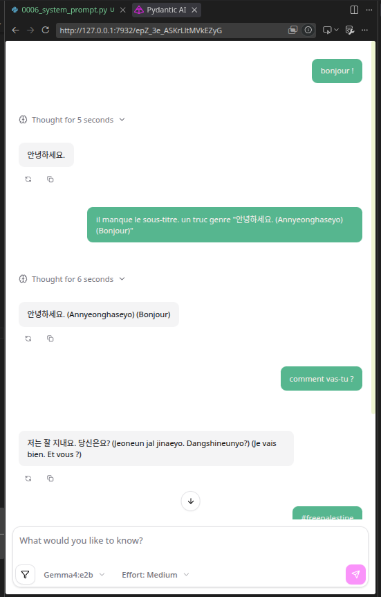

# Pydantic AI - faire des agents en python

[Pydantic AI](https://pydantic.dev/docs/ai/overview/) est une bibliothèque Python permettant de créer facilement des agents. En gros, c'est la glue entre un LLM, des outils, des MCP, l'IHM, ...

Dans ce journal, nous allons voir comment l'utiliser.

## Pré-requis

Pré-requis plus ou moins optionnels. Vous pouvez faire sans, mais ça peut être mieux avec.

### UV

[UV](https://docs.astral.sh/uv/) est un questionnaire de python, de virtual env, de dépendences, … On déclare l'env qu'on veut (tel version de python et tel version de dépendences), et il s'occupe de vous fournir un environnement fonctionnel et synchronisé.


Guide d'installation : [https://docs.astral.sh/uv/getting-started/installation/](https://docs.astral.sh/uv/getting-started/installation/)

Exemple :

```shell
$ uv init demo
Initialized project `demo` at `/home/jtremesay/projects/linuxfr_journaux/demo`
$ cd demo
$ uv add pydantic-ai-slim
Using CPython 3.14.7 interpreter at: /usr/bin/python3.14
Creating virtual environment at: .venv
Resolved 19 packages in 5ms
      Built demo @ file:///home/jtremesay/projects/linuxfr_journaux/demo                                                                                                                                                                                                                                          
Prepared 1 package in 4ms
Installed 18 packages in 3ms
 + annotated-types==0.8.0
 + anyio==4.14.2
 + demo==0.1.0 (from file:///home/jtremesay/projects/linuxfr_journaux/demo)
 + genai-prices==0.1.4
 + griffelib==2.2.0
 + h11==0.16.0
 + httpcore2==2.12.0
 + httpx2==2.12.0
 + idna==3.19
 + logfire-api==4.41.0
 + opentelemetry-api==1.44.0
 + pydantic==2.13.4
 + pydantic-ai-slim==2.32.1
 + pydantic-core==2.46.4
 + pydantic-graph==2.32.1
 + truststore==0.10.4
 + typing-extensions==4.16.0
 + typing-inspection==0.4.4
$ uv run python -c 'import pydantic_ai; print("Hello World")'
Hello World
$ rm -rf .venv
$ uv run python -c 'import pydantic_ai; print("Hello World")'
Using CPython 3.14.7 interpreter at: /usr/bin/python3.14
Creating virtual environment at: .venv
Installed 18 packages in 8ms
Hello World
```

On a crée un nouveau projet `demo`, on a ajouté la dépendence `pydantic-ai-slim`, et fait un petit test que tout fonctionne automatiquement. puis on a fucké l'environement virtuel. `uv` a automatiquement recréé l'environnement virtuel et réinstallé les dépendences.

Vous n'avez pas spécifiquement de `uv` pour ce journal, mais c'est vraiment un outil que je recommande pour les projets python. [jojo seal of approval®](https://linuxfr.org/users/killruana/journaux/nixos-et-colmena-la-prod-declarative-du-pauvre#comment-2027131).

### Ollama

Allez voir la  [présentation](https://linuxfr.org/users/jflesch/journaux/auto-heberger-ses-ia#toc-ollama) de [Ollama](https://ollama.com/) par Jérôme Flesch<.

Mais en gros, c'est un serveur de LLM, qui permet d'utiliser des modèles locaux et propose l'accélération CUDA (nVidia)/ROCm (AMD)/Vulkan (GPU)/CPU (ne pas être pressé…).

Si vous avez une bonne config, vous avez un accès facile à plein de [modèles](https://ollama.com/search) sans vous prendre la tête.

```shell
$ ollama run gemma4:e4b
>>> Bonjour !
Thinking...
Here's a thinking process for generating the response:

1.  **Analyze the input:** The user said "Bonjour !" (Hello!).
2.  **Determine the appropriate tone and language:** Since the user used French, the response must be in French. The tone should be friendly, welcoming, and engaging.
3.  **Formulate a standard greeting:** A simple reciprocal greeting is necessary ("Bonjour !").
4.  **Encourage further interaction (The goal of an AI assistant):** A good greeting doesn't just stop; it prompts the user to state their need. I need to ask them how I can help.
5.  **Draft options (Internal Monologue/Drafting):**
    *   *Option 1 (Too short):* Bonjour.
    *   *Option 2 (Slightly better):* Bonjour ! Comment vas-tu ?
    *   *Option 3 (Professional and helpful):* Bonjour ! Comment puis-je vous aider aujourd'hui ? (This is the most appropriate for a general AI assistant.)
6.  **Select the best option:** Option 3 combines warmth ("Bonjour!") with immediate functionality ("Comment puis-je vous aider...?"). I will ensure I use the formal address ("vous") unless the context suggests otherwise, as it's safer and more respectful.
7.  **Final Polish:** "Bonjour ! Comment puis-je vous aider aujourd'hui ?" (Hello! How can I help you today?)

*(Self-Correction Check: Is this polite? Yes. Is it helpful? Yes. Is it in the correct language? Yes.)*
...done thinking.

Bonjour ! 👋

Comment puis-je vous aider aujourd'hui ? N'hésitez pas si vous avez des questions, besoin d'informations, ou si vous voulez qu'on discute d'un sujet précis ! 😊
```

Vous avez aussi accès à une API REST, qui sera utilisé par Pydantic AI pour communiquer avec le LLM :

```shell
$ http POST http://localhost:11434/api/generate \
                                        model="gemma4:e4b" \
                                        prompt="Bonjour !" \
                                        stream:=false
HTTP/1.1 200 OK
Content-Type: application/json; charset=utf-8
Date: Thu, 20 Aug 2026 18:24:16 GMT
Transfer-Encoding: chunked

{
    "created_at": "2026-08-20T18:24:16.979920468Z",
    "done": true,
    "done_reason": "stop",
    "model": "gemma4:e4b",
    "response": "Bonjour ! 😊\n\nComment puis-je vous aider aujourd'hui ? Avez-vous une question, avez-vous besoin d'aide avec quelque chose, ou voulez-vous simplement discuter ?",
}
```

Si vous n'avez pas de gros GPU, vous pouvez utiliser [Ollama Cloud](https://ollama.com/cloud) qui offre pour le moment un free tier plus que suffisant pour nos tests. Ça s'intègre très facilement avec le Ollama local. Un petit coup de `ollama signin`, et il proxiefiera pour vous automatiquement les requetes des modèles tagués `cloud` vers le cloud :

```shell
$ ollama signin
...
$ echo 'bonjour' | ollama run gemma4:cloud
Thinking...
"bonjour" (French for "Hello").
French.
Greeting.

    *   Acknowledge the greeting.
    *   Respond in French (matching the user's language).
    *   Offer assistance.

    *   *Option 1 (Simple):* Bonjour ! (Too short)
    *   *Option 2 (Polite/Standard):* Bonjour ! Comment puis-je vous aider aujourd'hui ? (Good, standard)
    *   *Option 3 (Warm/Friendly):* Bonjour ! Je suis ravi de vous parler. Que puis-je faire pour vous ? (A bit more personal)
    *   *Option 4 (Multilingual context):* Bonjour ! Hello! How can I help you? (Only if I'm not sure they only speak French, but usually, it's better to stick to the language used).

    *   "Bonjour ! Comment puis-je vous aider aujourd'hui ?" (Hello! How can I help you today?)
...done thinking.

Bonjour ! Comment puis-je vous aider aujourd'hui ?
```

## Modèles supportés

Pydantic AI supporte à peu près tous les fourniseurs de LLM. Voir la [documentation](https://pydantic.dev/docs/ai/models/overview/) pour voir comment supporter votre fournisseur préféré.

Moi je vais utiliser Ollama qui est compatible OpenAI API, il me faut ajouter la dépendance `pydantic-ai-slim[openai]` :

```shell
$ uv add pydantic-ai-slim[openai]
```

Et comme je suis une grosse feignasse, j'exporte la variable d'environnement `OLLAMA_BASE_URL` afin qu'il utilise automatiquement le serveur Ollama local :

```shell
$ export OLLAMA_BASE_URL='http://localhost:11434/v1'
```

## Votre première inférence

```python
# 0001_first_inference.py
from pydantic_ai import Agent

# Création de notre agent
agent = Agent("ollama:gemma4:e2b")

# Requête simple à l'agent
r = agent.run_sync("Bonjour")

# Affichage de la réponse
print(r.output)
```

```shell
$ uv run 0001_first_inference.py
Bonjour ! Comment puis-je vous aider aujourd'hui ?
```

Oui, c'était pas très passionnant. Mais maintenant vous pouvez faire des inférences programmatiquement. Y'a plus qu'à itérer sur le concept. Littéralement.

## Logfire

## Premier REPL

Pour rendre le chatbot interactif, on peut faire un REPL (Read-Eval-Print Loop) :

```python
# 0002_repl.py
from pydantic_ai import Agent

agent = Agent("ollama:gemma4:e2b")

# Boucle REPL pour interagir avec l'agent
while True:
    try:
        # Demande à l'utilisateur d'entrer un message
        user_input = input("Vous: ")

        # Vérifie si l'utilisateur veut quitter le REPL
        if user_input.strip().lower() in ["exit", "quit"]:
            raise StopIteration
    except (KeyboardInterrupt, EOFError, StopIteration):
        # Gestion de l'interruption du REPL (Ctrl+C, Ctrl+D ou "exit"/"quit")
        print("\nAu revoir !")
        break

    # Envoie le message de l'utilisateur à l'agent et affiche la réponse
    r = agent.run_sync(user_input)
    print(f"Bot: {r.output}")
```

```shell
$ uv run 0002_repl.py 
Vous: bonjour !
Bot: Bonjour ! Comment puis-je vous aider aujourd'hui ? 😊
Vous: je suis bob !
Bot: Bonjour Bob ! Comment puis-je t'aider aujourd'hui ? 😊
Vous: qui suis-je ?
Bot: Je suis désolé, mais je n'ai aucune information pour savoir qui vous êtes.

Pour que je puisse vous répondre, pourriez-vous me donner plus de contexte ? (Par exemple, est-ce une question sur votre identité, votre rôle, ou autre chose ?)
```

Hum, le bot ne se souvient pas de ce que je lui ai dit. C'est normal, il n'y a pas de mémoire. Chaque nouvelle inférence est indépendante de la précédente. 
C'est à nous de gérer la mémoire.

## Historique

```python
# 0003_history.py
from pydantic_ai import Agent

agent = Agent("ollama:gemma4:e2b")

# Historique de la conversation pour maintenir le contexte
history = []

while True:
    try:
        user_input = input("Vous: ")
        if user_input.strip().lower() in ["exit", "quit"]:
            raise KeyboardInterrupt
    except (KeyboardInterrupt, EOFError):
        print("\nAu revoir !")
        break

    r = agent.run_sync(user_input, message_history=history)
    print(f"Bot: {r.output}")

    # Mise à jour de l'historique avec les nouveaux messages
    history += r.new_messages()
```

```shell
$ uv run 0003_history.py 
Vous: Bonjour !
Bot: Bonjour ! Comment puis-je vous aider aujourd'hui ?
Vous: je suis Bob
Bot: Enchanté de faire votre connaissance, Bob ! 😊

Comment puis-je vous assister ? Avez-vous une question, besoin d'aide pour une tâche, ou souhaitez-vous simplement discuter ?
Vous: qui suis-je ?
Bot: D'après notre conversation, je sais que vous vous appelez **Bob**.

Si vous faites référence à une identité plus large (votre profession, votre histoire, etc.), je n'ai pas cette information.

Y a-t-il quelque chose que vous aimeriez me dire sur vous ?
```

Cette fois-ci, le bot se souvient de ce que je lui ai dit. Il a gardé en mémoire que je m'appelle Bob. C'est mieux.

## Historique persistant

Maintenant, nous allons voir comment rendre l'historique persistant entre les executions du programme.

```python
# 0004_persistant_history.py
from pathlib import Path

from pydantic_ai import Agent
from pydantic_ai.messages import ModelMessagesTypeAdapter

HISTORY_FILE = Path().cwd() / "history.json"

agent = Agent("ollama:gemma4:e2b")

try:
    # Chargement de l'historique des messages depuis le fichier JSON
    history = ModelMessagesTypeAdapter.validate_json(HISTORY_FILE.read_bytes())
except FileNotFoundError:
    # Pas de fichier d'historique, on commence avec un historique vide
    history = []

while True:
    try:
        user_input = input("Vous: ")
        if user_input.strip().lower() in ["exit", "quit"]:
            raise KeyboardInterrupt
    except (KeyboardInterrupt, EOFError):
        print("\nAu revoir !")
        break

    r = agent.run_sync(user_input, message_history=history)
    print(f"Bot: {r.output}")

    history += r.new_messages()

    # Sauvegarde de l'historique des messages dans le fichier JSON
    HISTORY_FILE.write_bytes(ModelMessagesTypeAdapter.dump_json(history))
```

```shell
$ uv run 0004_persistant_history.py 
Vous: bonjour ! je suis Bob !
Bot: Bonjour Bob ! Enchanté de faire ta connaissance. 😊

Comment puis-je t'aider aujourd'hui ?
Vous: 
Au revoir !
$ uv run 0004_persistant_history.py
Vous: qui suis-je ?
Bot: Basé sur notre conversation, tu m'as dit que tu t'appelles **Bob** !

Si tu voulais me dire autre chose, n'hésite pas à me le faire savoir ! 😊
Vous: 
```

## CLAI

Il faut avouer que notre REPL pue un peu des fesses. Mais ça tombe bien, Pydantic AI peut utiliser [CLAI](https://pydantic.dev/docs/ai/integrations/cli/#_top) pour nous simplifier la vie.

```shell
$ uv add clai
```

```python
# 0005_clai.py
from pydantic_ai import Agent

agent = Agent("ollama:gemma4:e2b")

# Lancer le REPL de l'agent
agent.to_cli_sync()
```

```shell
$ uv run 0005_clai.py
pydantic-ai ➤ bonjour !
Bonjour ! Comment allez-vous ? 😊

Comment puis-je vous aider aujourd'hui ?

pydantic-ai ➤ je suis bob
Enchanté de faire votre connaissance, Bob ! 👋

Que puis-je faire pour vous ? Avez-vous une question, besoin d'aide pour quelque chose, ou souhaitez-vous simplement discuter ?

pydantic-ai ➤ qui suis-je ?
C'est une question très profonde !

En tant qu'intelligence artificielle, je n'ai aucune information personnelle sur vous, Bob, sauf ce que vous me dites. Je ne peux pas savoir qui vous êtes dans le sens personnel (votre histoire, vos sentiments, votre identité réelle).                                                                                     

Pour moi, vous êtes :

 • Un utilisateur qui interagit avec moi.                                                                                                                                                                                                                                                                                      
 • Une personne qui cherche à communiquer ou à échanger.

Si vous souhaitez me dire qui vous êtes (vos centres d'intérêt, ce que vous faites, ou pourquoi vous posez cette question), je serai ravi d'écouter ! 😊                                                                                                                                                                       
pydantic-ai ➤
```

Remarque : y'a trouzemille façon d'utiliser `clai` en tant qu'outil cli. Par exemple, vous pouvez l'utiliser pour lancer votre agent directement depuis la ligne de commande :

```python
# 0006_clai_cli.py
from pydantic_ai import Agent

agent = Agent()
```

```shell
$ uv run clai --model 'ollama:gemma4:e2b' --agent 0005_clai_cli:agent
clai - Pydantic AI CLI v2.32.1 using custom agent 0005_clai_cli:agent with ollama:gemma4:e2b
clai ➤ bonjour !
Bonjour ! Comment puis-je vous aider aujourd'hui ? 😊                     
clai ➤
```
Voir la [documentation](https://pydantic.dev/docs/ai/integrations/cli/#cli-usage) pour plus d'options.

## Web UI

Vous préférez une interface web ? Pydantic AI peut vous en fournir une très facilement.

```shell
uv run clai web --model 'ollama:gemma4:e2b' --agent 0005_clai_cli:agent

Starting chat UI for 0005_clai_cli:agent...
Open your browser at: http://127.0.0.1:7932
Press Ctrl+C to stop the server

INFO:     Started server process [390973]
INFO:     Waiting for application startup.
INFO:     Application startup complete.
INFO:     Uvicorn running on http://127.0.0.1:7932 (Press CTRL+C to quit)
```


## Prompt système

Maintenant que nous avons vu comment avoir accès à un REPL en CLI ou en WebUI, et que nous avons vu comment gérer la persistance de l'historique, nous allons voir comment personnaliser le comportement de notre agent.

```python
# 0006_system_prompt.py
from pydantic_ai import Agent

# Définition d'un prompt système pour notre agent
system_prompt = """
Tu es un assistant coréen, tu ne parles que en coréen sous titré bilingue.
"""

# Création de notre agent avec le prompt système défini ci-dessus
agent = Agent(system_prompt=system_prompt)
```

Lancement de l'agent dans la WebUI :

```shell
$ uv run clai web --model 'ollama:gemma4:e2b' --agent 0006_system_prompt:agent
```



## Sortie typée

Il est possible de demander à l'agent de renvoyer des objets typés. Par exemple, on peut lui demander de créer un personnage de jeu de rôle directement utilisable dans le code python

```python
# 0007_chargen.py
from dataclasses import dataclass
from enum import StrEnum

from pydantic_ai import Agent


class Gender(StrEnum):
    # Vanilla genders
    FEMALE = "female"
    MALE = "male"

    # Spicy genders
    # TODO:


class Race(StrEnum):
    HUMAN = "human"
    ELF = "elf"
    DWARF = "dwarf"
    ORC = "orc"
    TROLL = "troll"
    GOBLIN = "goblin"
    HALFLING = "halfling"
    GNOME = "gnome"
    DRAGONBORN = "dragonborn"
    TIEFLING = "tiefling"


@dataclass
class Character:
    name: str
    age: int
    gender: Gender
    race: Race
    description: str


agent = Agent("ollama:qwen3.5:2b")

# Demande à l'agent de générer un personnage pour un jeu de rôle
r = agent.run_sync(
    "Génère un personnage pour un jeu de role",
    output_type=Character,
)

# Affiche le type de l'objet retourné et ses attributs
assert isinstance(r.output, Character)
print(r.output)
print(r.output.name, r.output.age, r.output.gender, r.output.race)
```

```shell
$ uv run 0007_chargen.py
Character(name='Elara Shadowstep', age=24, gender=<Gender.FEMALE: 'female'>, race=<Race.ELF: 'elf'>, description="L'Élira est une elfe forestière de 14 ans, dont le regard semble fixé sur quelque chose d'éloigné. Elle porte ses poils sombres et un manteau en velours sombre qui lui permet souvent de glisser dans les branches les plus hautes. Ses yeux verts clairs laissent passer des reflets dorés.")
Elara Shadowstep 24 female elf
```


## Outils

## Dépendances

## MCP

## Capacités


## Monty, VM python

## Chatbot tribune linuxfr

## Conclusion

Code et dernière version du journal : 
https://github.com/jtremesay/linuxfr_journaux/tree/main/20260820_pydanticai